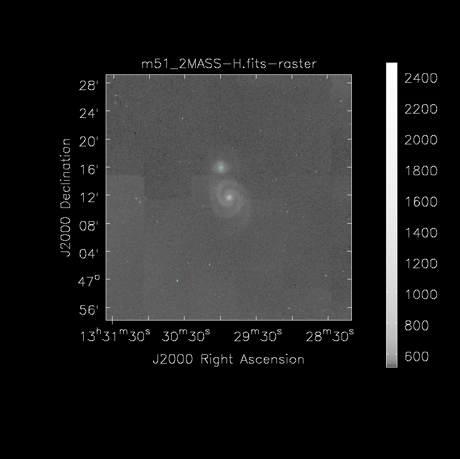

# multilambda_catalogs

`multilambda_catalogs.py` script takes R.A., Dec coordinates to download images for several predefined surveys (can be selected manually) using the python module `SkyView` from `astroquery`. It will produce images for a given FoV, by default 35 arcmin, as the FoV of e-MERLIN L-band data.

Normal example:
```python
python multilambda_catalogs.py -n my_source -ra 10:00:00 -de 40:00:00
```
- By default will use a radius of 35 arcmin and will try to download the following catalogs:  
["NVSS","VLA FIRST (1.4 GHz)", "WENSS", "TGSS ADR1", "VLSSr", "SDSSr", "DSS", "2MASS-H"]

- Source name can specify a directory location, for example:

```python
python multilambda_catalogs.py -n ./images/my_source -ra 10:00:00 -de 40:00:00
```
- The output is a set of fits file with the images from the available catalogs

### Requirements
- python3
- astropy
- astroquery
- (optional) casa


### Usage

```
usage: multilambda_catalogs.py [-h] [-n NAME] [-ra RA] [-de DE] [-r RADIUS]
                 [-s SURVEYS [SURVEYS ...]]

Select dataset

optional arguments:
  -h, --help            show this help message and exit
  -n NAME, --name NAME  Name prefix for output images
  -ra RA                R.A. coordinates in format 00:00:00.0
  -de DE                Dec. coordinates in format +00:00:00.0
  -r RADIUS, --radius RADIUS
                        Search radius in armin
  -s SURVEYS [SURVEYS ...], --surveys SURVEYS [SURVEYS ...]
                        Whispace separated list of surveys

```
### Example

```bash
$ python multilambda_catalogs.py -n m51 -ra 13:29:53 -de 47:11:43

['NVSS', 'VLA FIRST (1.4 GHz)', 'WENSS', 'TGSS ADR1', 'VLSSr', 'SDSSr', 'DSS', '2MASS-H']
Reading urls
OK:      NVSS
OK:      VLA FIRST (1.4 GHz)
OK:      WENSS
OK:      TGSS ADR1
OK:      VLSSr
OK:      SDSSr
OK:      DSS
OK:      2MASS-H
['https://skyview.gsfc.nasa.gov/tempspace/fits/skv10805523728758.fits'] NVSS
['https://skyview.gsfc.nasa.gov/tempspace/fits/skv10805529089701.fits'] VLA FIRST (1.4 GHz)
['https://skyview.gsfc.nasa.gov/tempspace/fits/skv10805535540620.fits'] WENSS
['https://skyview.gsfc.nasa.gov/tempspace/fits/skv10805542639392.fits'] TGSS ADR1
['https://skyview.gsfc.nasa.gov/tempspace/fits/skv10805551696775.fits'] VLSSr
['https://skyview.gsfc.nasa.gov/tempspace/fits/skv10805556004382.fits'] SDSSr
['https://skyview.gsfc.nasa.gov/tempspace/fits/skv10805599044502.fits'] DSS
['https://skyview.gsfc.nasa.gov/tempspace/fits/skv10805604930744.fits'] 2MASS-H
Getting fitsfiles
Downloading https://skyview.gsfc.nasa.gov/tempspace/fits/skv10805615868114_1.fits
|=======================================================================================================| 371k/371k (100.00%)         0s
Downloading https://skyview.gsfc.nasa.gov/tempspace/fits/skv10805615868114_2.fits
|=======================================================================================================| 377k/377k (100.00%)         0s
Downloading https://skyview.gsfc.nasa.gov/tempspace/fits/skv10805615868114_3.fits
|=======================================================================================================| 371k/371k (100.00%)         0s
Downloading https://skyview.gsfc.nasa.gov/tempspace/fits/skv10805615868114_4.fits
|=======================================================================================================| 371k/371k (100.00%)         2s
Downloading https://skyview.gsfc.nasa.gov/tempspace/fits/skv10805615868114_5.fits
|=======================================================================================================| 371k/371k (100.00%)         1s
Downloading https://skyview.gsfc.nasa.gov/tempspace/fits/skv10805615868114_6.fits
|=======================================================================================================| 374k/374k (100.00%)         2s
Downloading https://skyview.gsfc.nasa.gov/tempspace/fits/skv10805615868114_7.fits
|=======================================================================================================| 374k/374k (100.00%)         2s
Downloading https://skyview.gsfc.nasa.gov/tempspace/fits/skv10805615868114_8.fits
|=======================================================================================================| 377k/377k (100.00%)         0s
Writing to file: NVSS ......Done
Writing to file: VLA FIRST (1.4 GHz) ......Failed
Writing to file: WENSS ......Done
Writing to file: TGSS ADR1 ......Done
Writing to file: VLSSr ......Done
Writing to file: SDSSr ......Done
Writing to file: DSS ......Done
Writing to file: 2MASS-H ......Done
Trying to execute casa command:
casa --nologger --nologfile --nogui -c fits2png.py ./catalogs/m51

=========================================
The start-up time of CASA may vary
depending on whether the shared libraries
are cached or not.
=========================================

IPython 5.1.0 -- An enhanced Interactive Python.

PIPELINE CASA 5.6.2-2   -- Common Astronomy Software Applications

Found an existing telemetry logfile: /home/jmoldon/.casa/casastats-562-2-50eb71544ed0-20200204-162345-PIPELINE.log
Telemetry initialized. Telemetry will send anonymized usage statistics to NRAO.
You can disable telemetry by adding the following line to your ~/.casarc file:
EnableTelemetry: False
--> CrashReporter initialized.
Converting files: ['./catalogs/m51_VLSSr.fits', './catalogs/m51_NVSS.fits', './catalogs/m51_2MASS-H.fits', './catalogs/m51_DSS.fits', './catalogs/m51_SDSSr.fits', './catalogs/m51_TGSS_ADR1.fits', './catalogs/m51_WENSS.fits']
```

And the output in catalogs is:

```bash
├── catalogs
│   ├── m51_2MASS-H.fits
│   ├── m51_2MASS-H.fits.png
│   ├── m51_DSS.fits
│   ├── m51_DSS.fits.png
│   ├── m51_NVSS.fits
│   ├── m51_NVSS.fits.png
│   ├── m51_SDSSr.fits
│   ├── m51_SDSSr.fits.png
│   ├── m51_TGSS_ADR1.fits
│   ├── m51_TGSS_ADR1.fits.png
│   ├── m51_VLSSr.fits
│   ├── m51_VLSSr.fits.png
│   ├── m51_WENSS.fits
│   └── m51_WENSS.fits.png

```
Some of those resulting images are:




### Problems

Some times astroquery cannot download the fits images after several trials. It seems that this can help in that case: `rm  -r ~/.astropy/cache/astroquery/`
